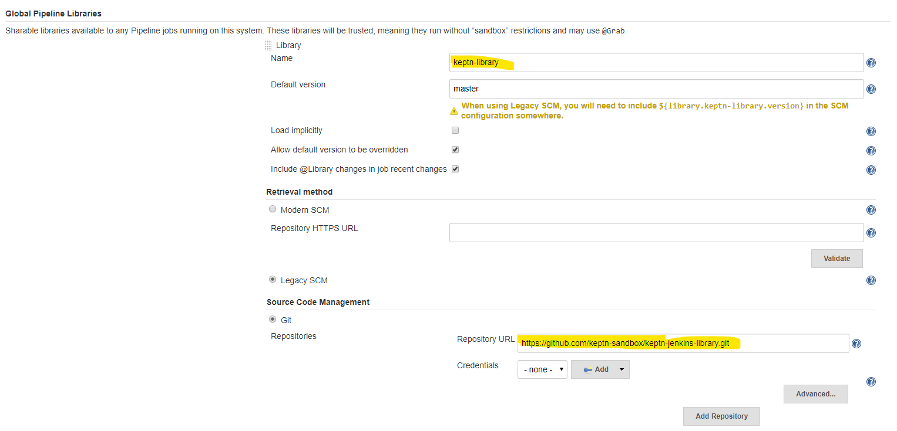
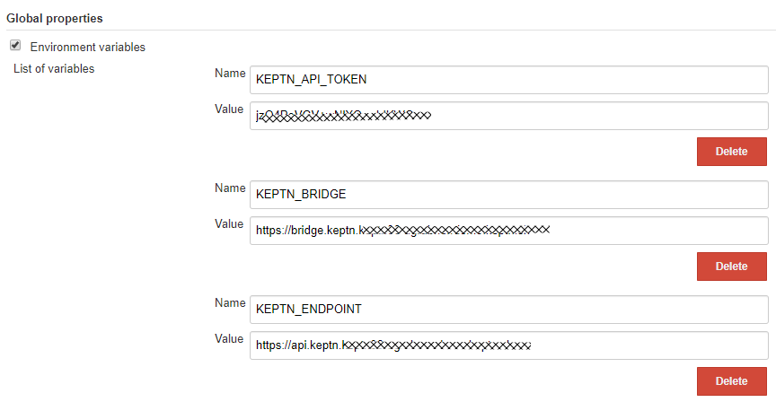

# Keptn Jenkins Shared Library
Jenkins shared library for integrating Keptn Use Cases with your Jenkins Pipelines

| Author | Library Version |
| ------ | ------------- |
| grabnerandi | master |

## Usage
In order to use this Jenkins Shared Library simply configure it in your Global Jenkins Configuration. Here is one way of doing this by pulling it from this GitHub repo:


The library also assumes the following global variables being configured in Jenkins: KEPTN_API_TOKEN, KEPTN_BRIDGE, KEPTN_ENDPOINT

You can obtain Keptn API Token and Endpoint as explained in the Keptn doc:
```
KEPTN_ENDPOINT=https://api.keptn.$(kubectl get cm keptn-domain -n keptn -ojsonpath={.data.app_domain})
KEPTN_API_TOKEN=$(kubectl get secret keptn-api-token -n keptn -ojsonpath={.data.keptn-api-token} | base64 --decode)
```
The KEPTN_BRIDGE is the link to your keptn bridge so that the Library can generate some deep links to the bridge to give you easy access to quality gate results!

Once you have everything configured use it in your Jenkins Pipeline like this

```groovy
@library('keptn-library')
import sh.keptn.Keptn
def keptn = new sh.keptn.Keptn()

// initialize keptn: will make sure this Keptn project & service is created and sets these values in a local context for other keptn.* functions
keptn.keptnInit project:"yourkeptnproject", service:"yourkeptnservice", stage:"yourkeptnstage", shipyard:'shipyard.yaml'

// upload a file to your keptn initialized project, service & stage
keptn.keptnAddResources('keptn/sli.yaml','dynatrace/sli.yaml')

// start a quality gate evaluation for the last 10 minutes shifted by 1 minute
def keptnContext = keptn.sendStartEvaluationEvent starttime:"660", endtime:"60" 
echo "Open Keptns Bridge: ${keptn_bridge}/trace/${keptnContext}"

// inform keptn about a new deploymed version to let Keptn execute tests and enforce quality gates
def keptnContext = keptn.sendDeploymentFinishedEvent testStrategy:"performance", deploymentURI:"http://yourapp.yourdomain.local"
echo "Open Keptns Bridge: ${keptn_bridge}/trace/${keptnContext}"

// wait for quality gave evaluation to be done
def result = keptn.waitForEvaluationDoneEvent setBuildResult:true, waitTime:waitTime
echo "${result}"
```